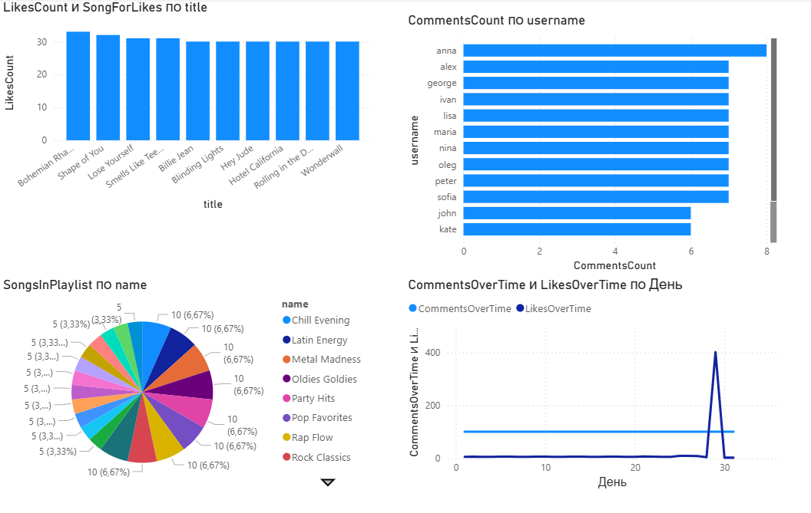

# YouTube-Music

## 🖥 Software Modeling and Analysis Project

### 📊 Model Diagrams
- **Conceptual Model** – Chen's Database Notation  
- **Logical Model** – Crow's Foot Database Notation  
- **Physical Model** – UML Database Notation  
- **Data Warehouse Model** – UML Database Notation, Snowflake & Star Schema  

### 🗄 Database
- **Platform:** MS SQL Server  
- **Tool:** Microsoft SQL Server Management Studio  
- **Tables:**   Tables: Artist, Album, Song, UserAccount, Playlist, PlaylistItem, UserLikesSong, Comment, Subscription;
- **Features:** Functions, Stored Procedures & Triggers  

### 📈 Power BI
- Visualizations of **Grades** & **Absences**

